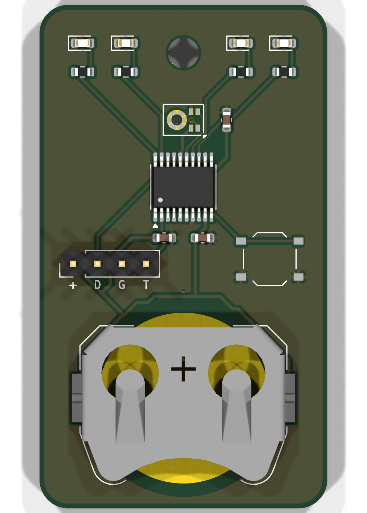

# dbfob hardware, rev A

30 × 52.5 mm, 2 layers, all parts on the top side. It is powered by a CR2032, the only input is one button, and the only output is a four-LED bar. Part choices are explained in [../docs/mic-mcu-options.md](../docs/mic-mcu-options.md).



## Everything regenerates

The procedure follows `studer-vca/etofab.md`. The tables in `tools/gen_sch.py` are the only source; do not hand-edit the sheet or the board.

```sh
python3 hardware/tools/gen_sch.py    # tables -> dbfob.kicad_sch
python3 hardware/tools/make_pcb.py   # schematic -> placed, routed, poured, DRC'd board (~30 s)
python3 hardware/tools/fab.py        # board -> production/
```

These need KiCad 10 (`kicad-cli` and the `pcbnew` Python module) and [KiCadRoutingTools](https://github.com/drandyhaas/KiCadRoutingTools) at `/home/mui/src/KicadRoutingTools` (override with `KRT=`).

State at commit:
- **ERC:** clean, apart from KiCad's library-table warnings and one expected `pin_to_pin` warning. That warning comes from the PWR_FLAG on MIC_VDD, which is powered by a GPIO.
- **DRC:** 0 errors, 0 warnings, 0 unconnected, 0 schematic-parity issues.
- **Reproducibility:** two runs give byte-identical boards.

## Circuit

| U1 pin | Port | Net | Function |
|---|---|---|---|
| 15 | PC5 | MIC_CLK | SPI1 SCK, the PDM clock: 1.5 MHz (see [clock plan](#pdm-clock-plan)) |
| 17 | PC7 | MIC_DATA | SPI1 MISO, the PDM data. MK1 SELECT is tied to GND |
| 16 | PC6 | MIC_VDD | GPIO push-pull. The mic is powered only while measuring (≈0.6 mA at 1.5 MHz). Discard audio until 50 ms after VDD *and* the clock are both running |
| 20 | PD3 | LED_G | TIM2_CH2, D1 yellow-green |
| 19 | PD2 | LED_Y | TIM1_CH1, D2 yellow |
| 14 | PC4 | LED_O | TIM1_CH4, D3 orange |
| 13 | PC3 | LED_R | TIM1_CH3, D4 red (anode side) |
| 12 | PC2 | LED_R_K | D4 cathode: drive low to light it; reverse-bias and time the decay to sense ambient light |
| 10 | PC0 | BTN | SW1 to GND. Use the internal pull-up; EXTI wakes the MCU from standby |
| 18 | PD1 | SWIO | Programming (WCH-LinkE) |
| 2 | PD5 | TX | USART1 TX: prints dB readings during calibration |

**LEDs.** The bar is deliberately dim: a club is dark and the fob should not light up the room. The resistors cap the current at about 0.45 mA (2.2 kΩ), or about 1 mA for the dimmer yellow-green (1 kΩ). Firmware uses PWM to go well below that indoors and shows the result for about 2 s.
- **Ambient light sensing.** D4's cathode is on PC2 rather than GND, so the red LED doubles as a light sensor. Reverse-bias it (PC3 low, PC2 high), switch PC2 to input, and time how long it takes to read low. Fast means bright, which lets the firmware tell a dark room from daylight.
- **Why these LEDs.** All four are low-Vf AlInGaP/GaP types (1.6–2.6 V), so every colour still lights near the end of the cell's life; InGaN green and blue LEDs need about 3 V.
- **Order.** The bar runs G Y · O R from left to right. The position of the lit LED also encodes the level, so the bar works for colour-blind users.

**J1** is four 2.54 mm pads: `+ D G T` = VBAT, SWIO, GND, TX. Fit a header by hand, or hold pogo pins against it. It is not assembled.

**Mic port.** MK1 is a bottom-port mic, so it hears through the 0.8 mm hole to the **back** of the board (marked MIC). Don't cover it, and give the case an opening there.

**Coin cell.** The Keystone 3034 uses a PCB pad as the − contact. The cell's + can wraps around onto the − face at the rim, so the top layer has no copper in the ring under the rim: only solder mask would stand between + and a GND pour. The − pad reaches ground through four vias inside the pad. There is no reverse-polarity protection; the holder only accepts the cell one way round.

## MCU: fitted with a CH32V003

The CH32V002 and CH32V006 had **zero stock at JLC/LCSC on 2026-09-27**, so the BOM carries the pin-compatible **CH32V003F4P6** (C5187096, 1035 in stock). The TSSOP-20 pinout is identical: it was checked against table 2-1 of the V002 datasheet. When stock returns, change the LCSC number in `gen_sch.py`. The board stays the same.

The V003 costs the project two things:
- **No hardware multiply.** Build the firmware for `rv32ec`, which runs on all three chips. The biquads cost more cycles but fit easily at 48 MHz.
- **Minimum supply of 2.7 V instead of 2.0 V.** How much of the cell that costs is **not known yet**. See [Power](#power-unqualified).

## PDM clock plan

The IM69D130 is specified only in four clock bands: 0.40–0.95, 1.05–1.9, 2.1–2.65 and 2.9–3.3 MHz (datasheet table 4). The CH32's SPI clock is its bus clock divided by a power of two, 2 to 256. The earlier plan of 1.024 MHz fell between two bands and could not be generated anyway.

The plan is **1.5 MHz**: 48 MHz / 32, or 24 MHz / 16 if the core runs at 24 MHz to save current. Decimating by 64 gives **23,437.5 samples/s**, so the audio bandwidth reaches about 11.7 kHz. The decimator and the A-weighting biquads are designed for exactly that rate. The mic's startup time (20 ms to ±0.5 dB, 50 ms to ±0.2 dB) counts from when both VDD and the clock are present (table 5).

Still to show on hardware: the V003 has no multiplier and 2 KB of RAM, so it must keep up with 1.5 Mbit/s of PDM continuously.

## Power (unqualified)

These are datasheet estimates. No board current has been measured yet.

- **Active.** The CH32V003 draws about 4–6 mA at 48 MHz (HSI), and the mic about 0.6 mA. A CR2032's internal resistance rises as it discharges and as it gets cold. With 50 Ω, 6 mA pulls a 3.0 V cell down to the V003's 2.7 V minimum, and the 10 µF cap bridges that for only about half a millisecond, not a 3 s measurement. The V003 can also run below its guaranteed range before its reset threshold trips.
  - Firmware runs the measurement at 24 MHz, and measures VDD under load against the internal reference throughout.
  - Below a cutoff with margin, it shows an explicit **invalid / battery** pattern instead of a level.
  - Qualification: log minimum VDD through acquisition and display, across cell state of charge and temperature, with real cells.
  - If usable capacity is too low, reconsider the MCU or supply in rev B.
- **Standby.** The V003's typical standby current is 7.6 µA (LSI off), about 67 mAh per year. That limits an idle fob to roughly 3 years on a 220 mAh cell, much more than self-discharge does. The CH32V002 would be worse, at 17.5 µA. The mic uses no standby current because it is unpowered. If shelf life matters, rev B could add a button-triggered power latch, so standby becomes a switch's leakage.

## Programming

J1 pin 1 is wired directly to the cell's + terminal. **Take the cell out before connecting a programmer or powering a board for calibration.** A WCH-LinkE supplying 3.3 V into an installed CR2032 would charge it, and Energizer allows 1 µA of reverse current at most. Put the cell back in afterwards. The legend on the back of the board says the same. A fixture should enforce this order, for example by physically blocking the holder. A board powered from its cell must be programmed with the programmer's supply pin unconnected.

## Ordering at JLCPCB

Upload `production/dbfob-gerbers.zip`, then for assembly `production/bom_jlc.csv` and `production/cpl_jlc.csv`.

- **PCB:** 2 layers, 1.6 mm, any colour, tented vias.
- **Finish: lead-free HASL for prototypes, ENIG for production.** At 5 boards ENIG took the PCBA order from €6.46 to €22 (2026-09-27) for little gain here. The mic's 0.45 mm pads on a 0.7 mm pitch solder fine on HASL, and the holder's spring presses the cell onto the slightly domed − pad. Choose lead-free rather than leaded HASL: these get carried on keyrings. At volume the ENIG premium per board shrinks, and its flat, non-oxidising battery contact becomes worth it.
- **Assembly:** economic, top side only, 15 placements, 12 BOM lines. J1 is not placed. Board cleaning: no.
- **Tooling holes.** On a 1×1 board without edge rails, JLC drills its tooling holes into the board itself, and ground copper covers almost all of both sides. In the placement review, check they stay clear of:
  - the cell's − pad and the copper-free ring around it,
  - the traces between the LEDs and U1,
  - the mic hole.

  If they don't, order a 1×1 panel with edge rails instead.
- **Extended parts:** U1, MK1, BT1, D1, D2 and D3 are extended. Each carries JLC's flat per-part setup fee regardless of quantity (etofab.md §7).
- **Low-stock lines to check before paying:**
  - MK1 IM69D130 (C536262): 614 in stock, about $3 each at small quantities.
  - D3 orange KT-0603O (C111340): 3979 in stock.
- **Placement is verified against JLC's own footprints.** JLC places each part with the EasyEDA footprint of its LCSC number. `tools/check_cpl.py` puts those footprints where the CPL says and checks three things: every pad lands on the KiCad pad of the same pin, MK1's port lands on the sound hole, and BT1's opening faces the board edge. `fab.py` refuses to finish if any check fails. The corrections are in `JLC_FRAME` in `fab.py`:
  - U1: +270°.
  - MK1: +90°, and the CPL point moves 0.13 mm, because EasyEDA's origin is not the package centre.
  - BT1: +180°. Its pads are symmetric but the opening is not.
  - LEDs: none. The cathode is on the left in both libraries, even though the pad numbers differ.

  Rev A's first CPL had MK1 turned 90° and BT1 backwards; this check is what caught it. Still glance at JLC's preview before paying.
- **MK1 is a MEMS mic with an open port.** Make sure the board is not water-washed after reflow.

## Microphone supply

On 2026-09-27, DigiKey lists IM69D130V01XTSA1 as *Active*. The [hardware audit](../docs/hardware-audit-2026-09-27.md) reports that Infineon marks this ordering code *not for new design*; I could not confirm that on Infineon's site. Either way, rev A is a prototype and limited-build decision. Before repeat production, confirm the status and either secure supply or move to a replacement. The TDK T5818 is 1.65–3.63 V, ±1 dB and 135 dB AOP in its 2.0–3.3 MHz mode. A replacement means revalidating the footprint, clock plan and signal processing.

## Release gates

`make_pcb.py` exits nonzero on any DRC error, open net, schematic-parity issue, or DRC warning other than the missing-library-table one. `fab.py` refuses to write anything unless ERC, DRC and parity are clean. The only exceptions are the library-table warnings and the documented MIC_VDD PWR_FLAG. It builds every output in `production.staging/`, runs `check_cpl.py` there, and only then replaces `production/`. `check_cpl.py` also requires the BOM and CPL designator sets to match, each designator to appear once, and each CPL layer to match the board side.

## Not verified yet

This is rev A and no hardware exists. Open items before calling it done:
- Continuous 1.5 MHz PDM acquisition and decimation on the V003 (no multiplier, 2 KB RAM).
- Weighted level accuracy across frequency, SPL, hand placement and battery state, and behaviour on overload.
- The mic's current when powered from a GPIO.
- Standby current, VDD under load across cell state (see Power), and so usable capacity and shelf life.
- Mechanical: cell insertion, removal and retention, keyring abrasion, sound-port occlusion in the hand and in the final case. The render has no 3D model for the mic.
- The hand-held level offset.
